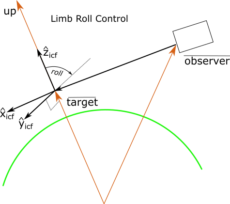
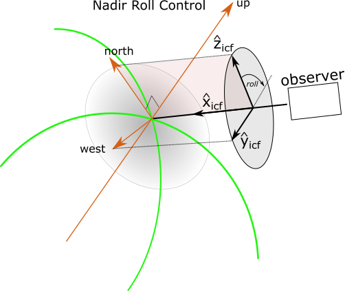
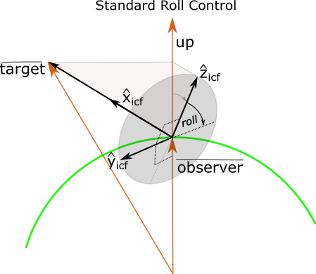

..  _rollcontrol:

************
Roll Control
************
Full specification of the platform orientation in space requires the roll of the instrument :math:`\hat{z}_{ICF}` axis
around the instrument :math:`\hat{x}_{ICF}` axis. The ``skplatform.orientation_techniques`` package uses of three
methods to determine the location of zero roll, see table below. Each definition has been chosen so the default value of
0.0 corresponds to the value normally chosen for that class of simulations.

=========================== ========================================================================================================
 Roll Control Setting       Description
=========================== ========================================================================================================
:ref:`rollcontrol_limb`     Limb observations: the zero point of roll is parallel to local up at the tangent point.
:ref:`rollcontrol_nadir`    Nadir observations: the zero point of roll is parallel to local north at the given point.
:ref:`rollcontrol_standard` Aircraft, balloon, ground site: the zero point of roll is parallel to local up at the observer location.
=========================== ========================================================================================================

Roll is always measured clockwise when looking along the look vector from the observer's position, i.e. the +Z instrument
axis rotates towards the -Y direction, similar to the roll definition used in aircraft systems.

The roll control value, if required, is provided as one of the parameters given in each pointing technique declaration
and many pointing techniques allow you to omit the value and assume the default value of 0.0.

------------------------------------------------------------------------------------------------------------------------

..  _rollcontrol_limb:

limb
====
The ``limb`` roll control setting is typically used for limb viewing geometries. This setting defines the point of zero roll
as the point where the instrument :math:`\hat{y}_{ICF}` axis is aligned with the horizon at the tangent point. This is determined
by aligning the instrument :math:`\hat{z}_{ICF}` with the vertical unit vector at the tangent point. This ensures
the instrument :math:`\hat{y}_{ICF}` axis is parallel to the horizon and points to the portside of the boresight.

    Limb control aligns instrument :math:`\hat{z}_{ICF}` with the *up* unit vector at the tangent point

The ``limb`` roll control setting is not meaningful for several scenarios. For example, look directions that are straight
down have poorly defined horizons and result in definitions which at best are not sensible. Similarly look vectors that
point upwards only have tangent points that are behind the observer and this, again, results in definitions  which are not
sensible.

The :class:`~.platforms.OrientationTechniques` class will reject all measurement states with the ``limb`` roll control
setting if the target tangent point is above the observer's position or is below 5000 meters below the surface of the
Earth.

------------------------------------------------------------------------------------------------------------------------

..  _rollcontrol_nadir:

nadir
=====
The ``nadir`` roll control setting is typically used for nadir viewing geometries. This setting defines the point of zero roll
as the point where the instrument :math:`\hat{z}_{ICF}` axis is aligned with geographic *North* at the target point. It is determined
by rotating the instrument :math:`\hat{z}_{ICF}` axis around the boresight, :math:`\hat{x}_{ICF}`, until the boresight,
the *North* unit vector and the instrument :math:`\hat{z}_{ICF}` are all co-planar with
:math:`\hat{z}_{ICF}` co-aligned with *North*. This ensures the instrument :math:`\hat{y}_{ICF}` axis is
parallel to the horizon and points to the portside of the boresight.

    nadir control aligns instrument :math:`\hat{z}_{ICF}` with the *North* unit vector at the nadir target point

The ``nadir`` roll control setting is not meaningful for several scenarios. For example, look directions that are horizontal
are poorly defined nadir geometries and result in definitions which, at best, are not sensible. Similarly look vectors that
point upwards only have nadir points that are behind the observer and this, again, results in definitions  which are not
sensible.

------------------------------------------------------------------------------------------------------------------------

..  _rollcontrol_standard:

standard
========
The ``standard`` roll control setting is typically used for ground-based sites, aircraft and balloons.  The
``standard`` setting defines the point of zero roll as the point where the instrument :math:`\hat{y}_{ICF}` axis is in the horizontal
plane at the observer's location. It is determined by rotating the instrument :math:`\hat{z}_{ICF}` axis around the boresight, :math:`\hat{x}_{ICF}`, until the boresight,
the *up* unit vector and the instrument :math:`\hat{z}_{ICF}` are all co-planar with
:math:`\hat{z}_{ICF}` co-aligned with *up*.

    ``standard`` roll control places the instrument :math:`\hat{y}_{ICF}` axis in the horizontal plane of the observer.

The ``standard`` roll control setting is sensible but has the unfortunate property that it is ill-conditioned for look vectors
which are straight up or down as all roll values place :math:`\hat{y}_{ICF}` in the horizontal plane.
To assist with this issue, the code allows orientation techniques to specify a horizontal unit vector which is derived
from *azimuth* or *yaw* parameters passed in from the user. If the specific orientation technique does not provide hints about
the horizontal vector then :class:`~.OrientationTechniques` will choose the *North* direction as the reference horizontal
direction for all look vectors. This latter option is not optimal as it results in abrupt changes in roll configuration
at angles within ~0.5 degrees of vertical.

