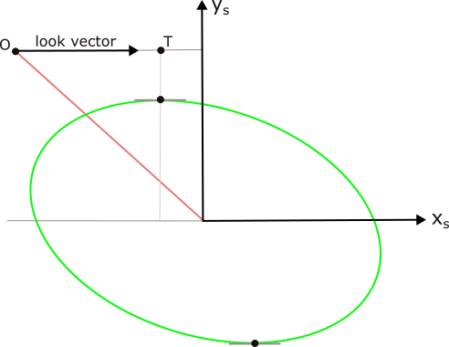
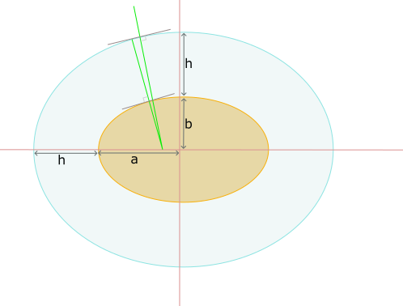

===================
Limb Tangent Point
===================
This will describe the determination of the limb point given an altitude and location on an oblate spheroid Earth.

The problem is to locate the limb tangent point for an observer looking in a given location towards an oblate
spheroid Earth. This analysis assumes that the plane of the look direction is known but not the pitch (or elevation).

The problem reduces to two sections:

#. Find the intersection of the look plane with the oblate spheroid.
#. Find the limb points on the look plane intersection. There will generally be two solutions.

The equation of an ellipsoidal Earth is given by,

..  math::
    :label: eqn_standard_ellipse

    \frac{x^2}{a^2} + \frac{y^2}{b^2} + \frac{z^2}{c^2} = 1

For an oblate spheroid the x and y axes as given by :math:`a` and :math:`b` will be equal. We consider an observer located above
the oblate spheroid at location :math:`O`. The observer is looking down from their location at a specific azimuth with a specific look vector.
We wish to find the location of the tangent point of this look vector.

The first step identifies the plane defined by the vector location of the observer and the look vector. This is a plane that
contains the look vector and passes through both the observer and the center of the Earth. We then introduce a new coordinate system, focussed on this plane,
which is rotated with respect to the standard, earth centered coordinate system.  The x-axis, :math:`\hat{x}_s`, of the new system is
parallel to the look vector but its origin is still located at the center of the Earth. The new y-axis, :math:`\hat{y}_s`, is perpendicular to :math:`\hat{x}_s` but
is fully contained within the plane. The z-axis, :math:`\hat{z}_s,` is perpendicular to the plane and plays no significant role in our analysis.
We establish the rotation matrix that relates, :math:`(x_s, y_s, z_s)`, to the earth centered coordinates, :math:`(x, y, z)`,

..  math::

    x = w_{11}x_s + w_{12}y_s + w_{13}z_s \\
    y = w_{21}x_s + w_{22}y_s + w_{23}z_s \\
    z = w_{31}x_s + w_{32}y_s + w_{33}z_s

The plane defined by two new unit vectors :math:`\hat{x}_s` and :math:`\hat{y}_s` slices through the oblate spheroid of the Earth
and generates a new conic section, :numref:`fig_ellipse_intersection`. The tangent point occurs when the look vector, as defined by :math:`\hat{x}_s`
is parallel to the new conic section.

..  _fig_ellipse_intersection:

    The tangent point is found by choosing location where the gradient is parallel to the limb.

If we are only considering points constrained to the conic section then :math:`z_s`, is zero and the conic section , which is constrained to the plane,
is given by,

..  math::
    :label: eqn_primed_offset

    x = w_{11}x_s + w_{12}y_s \\
    y = w_{21}x_s + w_{22}y_s \\
    z = w_{31}x_s + w_{32}y_s

Substitution of the above transforms into equation :eq:`eqn_standard_ellipse` for the standard ellipse gives the equation
of the conic section,

..  math::
    :label: eqn_ellipse_offset

    A\;x_s^2 + B\;y_s^2 + C\;x_sy_s = 1

where,

..  math::

    A = \left( \frac{w_{11}^2}{a^2} + \frac{w_{21}^2}{b^2} + \frac{w_{31}^2}{c^2} \right)

..  math::

    B = \left( \frac{w_{12}^2}{a^2} + \frac{w_{22}^2}{b^2} + \frac{w_{32}^2}{c^2} \right)

..  math::

    C = \left( \frac{2\;w_{11}w_{12}}{a^2} + \frac{2\;w_{21}w_{22}}{b^2} + \frac{2\;w_{31}w_{32}}{c^2} \right)

The gradient of the conic section is found by differentiating equation :eq:`eqn_ellipse_offset` to get,

..  math::
    :label: eqn_ellipse_gradient

    2Ax_s + 2 By_s\left(\frac{\mathrm{d}y_s}{\mathrm{d}x_s}\right) + Cx_s\left(\frac{\mathrm{d}y_s}{\mathrm{d}x_s}\right) + Cy_s  = 0

The limb tangent point is found by demanding that the gradient of the look vector from the observer, parallel to :math:`\hat{x}_s`,
equals the gradient of the ellipse in the look plane; specifically, :math:`\frac{\mathrm{d}y_s}{\mathrm{d}x_s} = 0`. Upon substitution this gives,

..  math::

    2Ax_s + Cy_s = 0

thus the value of :math:`y_s` on the conic section at the tangent point is given by,

..  math::

    y_s = -\frac{2Ax_s}{C}

substitution of :math:`y_s` at the tangent into equation :eq:`eqn_ellipse_offset` gives the value of :math:`x_s` on the conic section at the tangent point.

..  math::

    Ax_s^2 + B\frac{(2Ax_s)^2}{C^2} - 2Cx_s\frac{2A_x}{C} = 1

which can be solved for :math:`x_s` to give,

..  math::
    :label: eqn_tan_point_x_s

    x_s = \pm \frac{C}{A^{\frac{1}{2}}} \sqrt{ \frac{1}{4AB - C^2}}

Bug Fix: Gradient Adjustment
----------------------------
There is a bug in the above analysis: the tangent point at height, :math:`h`, is not exactly parallel to the gradient at the ground.

    The tangent point at height *h* is not exactly parallel to the tangent point at the ground.

The adjustment is small for the Earth's atmosphere, typically around ten to twenty centimeters for  calculations in the
stratosphere. We provide an additional correction term based upon the derivative of :math:`x_s` with height :math:`h`.

We use the first solution given above to calculate the nominal height, :math:`h`, of the tangent point. We then use this
nominal height to update our values of :math:`A`, :math:`B` and :math:`C` which are then used to re-calculate :math:`x_s`
and :math:`y_s`.

This adjustmest doubles the length of the calculation, as we repeat the entire calculation, but it brings this technique
into agreement with other techniques within fractions of a millimeter.

