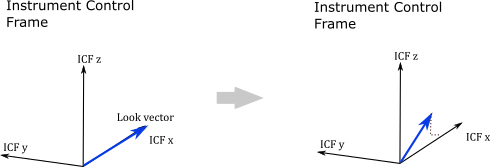
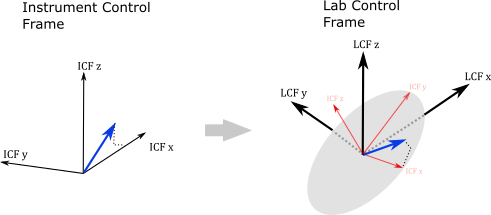
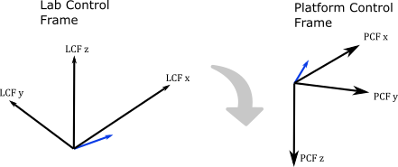

.. _controlframes:

Control Frames
===============
The ``skplatform`` package uses the following coordinate systems during its analysis

- Instrument Control Frame (ICF)
- Laboratory Control Frame (LCF)
- Platform Control Frame (PCF)
- Geodetic Control Frame (GCF)
- Geographic Geocentric (ECEF)

Instruments coordinates are defined in the Instrument Control Frame with :math:`\hat{x}` along the optical-axis or boresight
of the instrument. Fields of view and lines of sight emanating from the instrument are canonically described in this
coordinate frame. The goals of the transforms are,

 - Convert unit vectors from the instrument control frame to the geographic geocentric control frame for easy use by radiative transfer code.
 - Provide methods to orient the instrument so it is looking at specific points on the Earth's surface or atmosphere.

The **instrument** is mounted on a **platform** and by default the instrument's optical axis is aligned
with the platform's :math:`\hat{x}` unit vector, which is often the *forward* direction but can be arbitrary.
The instrument's mounting orientation on the platform is changed by setting the instrument's *azimuth*, *elevation* and *roll*.

The platform is initially configured so its *forward* unit vector, :math:`\hat{x}`, is looking North, regardless of location.
The platform can be rotated to point in other directions by setting its *yaw*, *pitch* and *roll*. Simulator code may avoid setting
yaw, pitch and roll directly and instead invoke helper functions to set them so the instrument is looking towards a specific point
on the Earth's surface or atmosphere.

The platform pointing coordinates are converted from geodetic coordinates to geographic-geocentric coordinates once the platform's
location in space is determined by specifying *latitude*, *longitude* and *height*.

Processing
-----------

The attitude solution flows via a set of rotation matrices from look vectors expressed in the Instrument Control Frame to
the same look vectors expressed in global ECEF unit vectors.

.. rst-class:: table table-striped

====== =============================================================  ======================= ============ ================
Step   Description                                                    Target Matrix           Simulations  Instruments
====== =============================================================  ======================= ============ ================
 1     Define look vectors in the Instrument Control Frame                                    Optional     Recommended
 2     Initialize ICF to be co-aligned with LCF.                      :math:`R_{LCF} = I`     Implicit     Implicit
 3     Mount instrument in Lab Control Frame, set azimuth, elevation  :math:`R_{LCF}`         Optional     Recommended
 4     Flip LCF to co-align with PCF                                                          Implicit     Implicit
 5     Initialize PCF to be co-aligned with GCF                       :math:`R_{PCF} = I`     Implicit     Implicit
 6     Rotate platform with yaw, pitch roll, algorithms etc.          :math:`R_{PCF}`         Yes          Yaw, Pitch, Roll
 7     Set Location of platform to lock GCF to global coords                                  Yes          Yes
 8     Rotate local GCF coords to global ECEF coords                                          Yes          Yes
====== =============================================================  ======================= ============ ================

    Look vectors are defined within the ICF frame.

Step 1: Define look vectors in ICF
^^^^^^^^^^^^^^^^^^^^^^^^^^^^^^^^^^

The ICF\ :sub:`x` axis is defined as the nominal boresight of the instrument while the ICF\ :sub:`y` and ICF\ :sub:`z` are usually
parallel to the detector image plane axes. By default, the system is created with one look vector parallel to the ICF\ :sub:`x` axis
but this can be changed the user to be either a single look vector or an array of look vectors.

The look vectors usually represent lines of sight associated with specific locations on the detector image plane (eg pixels). The look vectors
are expressed in terms of the ICF unit vectors.

Step 2: Mount the ICF in the Laboratory Control Frame
^^^^^^^^^^^^^^^^^^^^^^^^^^^^^^^^^^^^^^^^^^^^^^^^^^^^^

    The entire ICF frame and look vectors are intrinsically rotated to the lab control frame.

Right-handed intrinsic rotations are applied to the Instrument Control Frame and look vectors. This
rotation represents mounting an instrument on an aircraft, gondola or laboratory table where the whole  instrument is physically
rotated with respect to the axes used in the lab, aircraft, gondola.  After transformation the look vectors are expressed in LCF coordinates.

By default the Labortaory Control Frame and the Instrument control frame are co-aligned, implying its has no action unless
rotation matrices are actively set . The laboratory control frame is typically used by real instruments in real experiments
but is ignored by most simulation code.

Step 3: Flip the LCF to the Platform Control Frame
^^^^^^^^^^^^^^^^^^^^^^^^^^^^^^^^^^^^^^^^^^^^^^^^^^
We provide an intermediate intrinsic rotational transform where look vectors expressed in the lab control frame are transformed
to the platform control frame by rolling 180 degrees around LCF\ :sub:`x`. The platform control frame has a coordinate system similar to aircraft, where the X is in the
forward direction, Y axis is to starboard and the Z axis is downward.

    Flip the laboratory control frame to the platform control frame. Roll 180 degrees around LCF\ :sub:`x`.

The platform control frame is used by both real instruments and by simulation code. Real instruments will typically provide
time series of the yaw, pitch and roll provided by the platform (spacecraft, aircraft, gondola etc.) while simulations
use various methods and techniques to orient the platform so the instrument is looking at a specific target.

By default the Platform Control Frame is co-aligned with local geodetic coordinates:

    * PCF\ :sub:`x` is pointing due North
    * PCF\ :sub:`y` is pointing due East
    * PCF\ :sub:`z` is pointing straight down.

Step 4: Rotate PCF with yaw, pitch, roll
^^^^^^^^^^^^^^^^^^^^^^^^^^^^^^^^^^^^^^^^

.. _icf:

Instrument Control Frame (ICF)
------------------------------------
The Instrument Control Frame (ICF) specifies a 3 axis right-handed system that is fixed to the instrument. Lines of sight
and field of views are defined in this control frame. These entities are typically rotated into the platform control frame
and from there rotated to look at a given target point.

  .. image:: figures/ICF_3axes.png
     :scale: 50 %
     :alt: Instrument Control Frame

The :math:`\hat{x}` unit vector of the ICF is arranaged so it parallel to the nominal optic axis or boresight of the
instrument and points away from the instrument.  The :math:`\hat{y}` and :math:`\hat{z}` unit vectors are in the plane
of the entrance aperture and :math:`\hat{z}` is placed so it has an upwards component when the instrument is sitting on
a table in a lab. The :math:`\hat{y}` is chosen to form the third axis of a right-handed system but is often placed so
it is horizontal.

 .. image:: figures/ICF_initial_orientation.png
   :scale: 100 %
   :alt: Instrument Control Frame

The instrument control frame is initialized so it is aligned upwards with resepect to the platform control frame with the
boresight of the instrument :math:`\hat{x}_{ICF}` parallel to :math:`\hat{x}_{PCF}`. The respective :math:`\hat{y}` and :math:`\hat{z}`
unit vectors are anti-parallel.

All rotations, typically azimuth and elevation, that are applied to place the instrument into its mounted position in the platform
control frame should start by assuming the instrument control frame is in its initial orientation with respect to the
platform control frame.

.. _lcf:

Lab Control Frame (LCF)
------------------------------------
The Laboratory Control Frame (ICF) specifies a 3 axis right-handed system used to represent a laboratory environment. This
will typically represent an actual lab environment or a gondola, aircraft of spacecraft mounting platform. It can also be used
to account for steering mirror movement within the instrument.

The lab control frame is initialized so it is aligned upwards with resepect to the platform control frame with the
boresight of the instrument :math:`\hat{x}_{ICF}` parallel to :math:`\hat{x}_{LCF}`. The respective :math:`\hat{y}` and :math:`\hat{z}`
unit vectors are parallel.

.. _pcf:

Platform Control Frame (PCF)
----------------------------
The Platform Control Frame (PCF) specifies the coordinate system used by the platform that the instrument is mounted too.
Typical platforms are satellites, aircraft, gondola as well as observatories on the ground.  Platforms will define a 3 axis
right-handed system. For aircraft the :math:`\hat{x}` is parallel to the body of the plane and points forward,
:math:`\hat{z}` is perpendicular to the body and wings and points downward when the plane is flying level, :math:`\hat{y}`
is parallel to the wings and points to the startboard side. Satellites and balloon gondolas may choose other ways to specify
the 3 axis system but keep in mind that all rotations are right-handed and using other coordinate systems, where
:math:`\hat{z}` is up for example, may generate counter-intuitive rotations when using yaw, pitch, azimuth or elevation.

 .. image:: figures/PCF_3axes.png
   :scale: 50 %
   :alt: Platform Control Frame

All platforms are able to express the 3 unit vectors in terms of local geodetic coordinates (west,south up) or
geographic geocentric coordinates.

The Platform Control Frame is initialized so :math:`\hat{x}_{PCF}` is co-aligned with local North, :math:`\hat{y}_{PCF}`
is pointing East and :math:`\hat{z}_{PCF}` is pointing downwards.

 .. image:: figures/PCF_initial_orientation.png
   :scale: 100 %
   :alt: Platform Control Frame

.. _gcf:

Geodetic Control Frame (GCF)
----------------------------
The geodetic control frame is a 3 axis right-handed system defined at any location by the geodetic latitude and
longitude.

 .. image:: figures/GCF_3axes.png
   :scale: 50 %
   :alt: Geodetic Control Frame

The :math:`\hat{x}` is given by local east, :math:`\hat{y}` is given by local north and :math:`\hat{z}` is
given by local up. This coordinate system is based upon an oblate spheroid geoid where :math:`\hat{z}` is
perpendicular to the surface of the oblate spheroid and does not usually pass through the center of the Earth.

..  _ecef:

Geocentric Control Frame (ECEF)
-------------------------------
The geocentric control frame is a geographic coordinate system with its origin at the centre of the (oblate spheroid)
Earth. The system is synonomous with the `ITRF <https://en.wikipedia.org/wiki/International_Terrestrial_Reference_System_and_Frame>`_ system
using the WGS84 reference sphere. The :math:`\hat{z}` is parallel to the rotation axis of Earth and points from the center through the North pole.
The :math:`\hat{x}` points in the plane of the equator from the center of the Earth to the Greenwich meridian (in the
Atlantic ocean just off the cosat of Africa). The :math:`\hat{y}` forms the third axis of a right-handed system and points
from the center in the plane of the equator to the 90E meridian (in the Indian ocean west of Sumatra). The system rotates
with the Earth.

